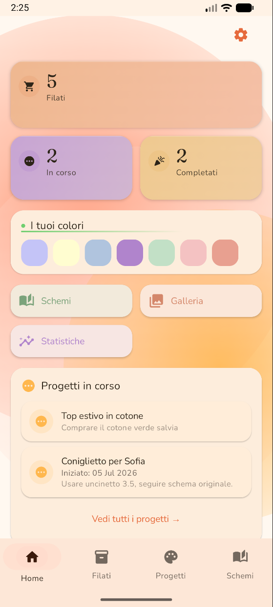
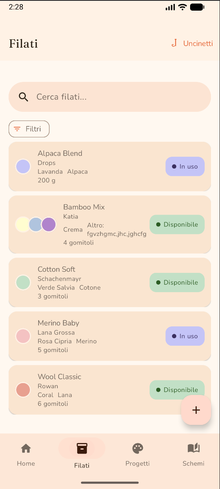
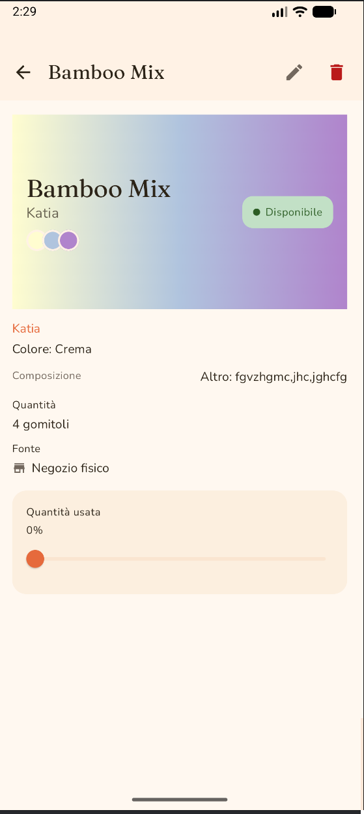
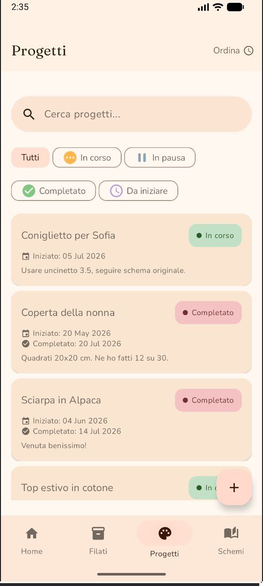
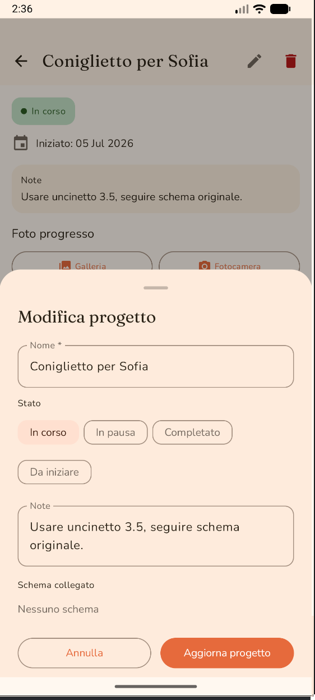
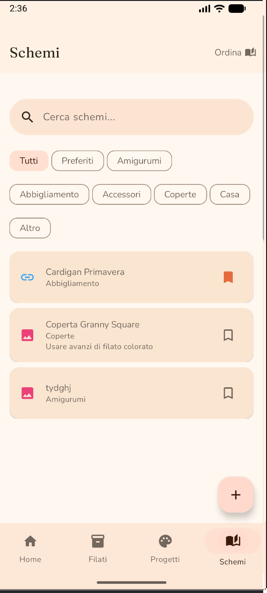
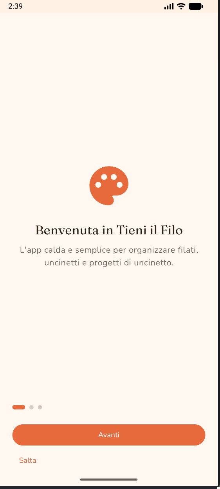
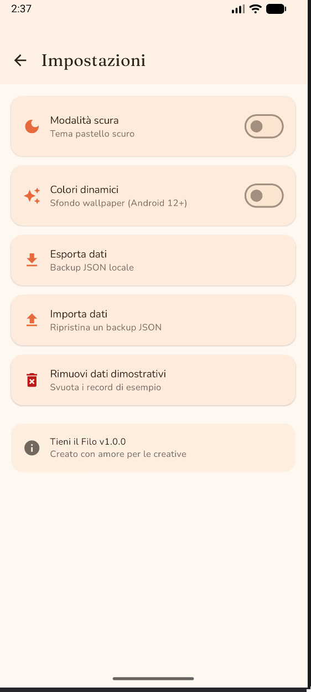
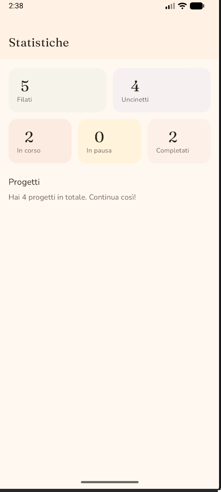

<div align="center">
  <h1>🧶 Tieni il Filo</h1>
  <p><em>L'app calda e semplice per organizzare filati, uncinetti e progetti a uncinetto.</em></p>

  <p>
    
    
    
    
    
    
    
    
    
  </p>

  <p>
    
    
    
  </p>
</div>

<br>

## 📥 Installazione rapida

> Vuoi provare l'app senza compilare il codice?

👉 **[Scarica APK release (firmato)](apk/app-release.apk)** — versione ufficiale, 3.2 MB

1. Scarica `app-release.apk` sul tuo telefono Android (8.0+)
2. Apri il file dal gestore file (o dalle notifiche di download)
3. Se richiesto, abilita **"Installazione da origini sconosciute"** per il gestore file
4. Tocca **Installa** e apri 🧶

> Esiste anche una [build debug](apk/app-debug.apk) per sviluppatori.

<br>

## ✨ Caratteristiche

🧶 **Filati** — Catalogo completo: nome, marca, colore (multicolore con badge accavallati), composizione, quantità in gomitoli/grammi/metri, prezzo, fonte. Filtri per stato e composizione, ricerca testuale, ordinamento per nome/data.

🪝 **Uncinetti** — Gestione con dimensione in mm, materiale (metallo, bamboo, ergonomico…) e marca, raggiungibili dalla sezione Filati con un'icona custom a forma di uncinetto.

📋 **Progetti** — Crea, collega a filati e schemi, aggiungi foto di progresso (galleria o fotocamera), segna come completato con confetti animato. Hero gradient derivato dallo stato del progetto (ambra/verde/lilla).

📑 **Schemi** — Importa PDF, immagini o link da blog/Ravelry. Organizza per tipo (amigurumi, abbigliamento, coperte…), aggiungi ai preferiti. Filtri e ricerca.

🎨 **Design system** — Palette neopastel vibrante (#E66A3C / #FF8A5B / #6FCE6F), tipografia **Fraunces** + **Nunito** via Google Fonts, shapes squircle, warm gradient mesh animato dietro la Home.

🎬 **Animazioni** — Press feedback su tutte le card, entrata a cascata dei list item, contatore animato nei numeri, page indicator animato nell'onboarding, pill attivo nella bottom nav, AnimatedFab.

🔍 **Ricerca & ordinamento** — SearchBar espandibile in Filati, Progetti e Schemi. Menu "Ordina" con dropdown per nome/data/scadenza.

↩️ **Snackbar con Annulla** — Elimina con sicurezza: 10 secondi per ripensarci.

🎨 **Colori dinamici** — Material You opzionale (Android 12+): usa il wallpaper come palette. Toggle in Impostazioni.

💾 **Backup & restore** — Esporta e importa tutti i dati in JSON locale.

📷 **Foto ovunque** — Scatta dalla fotocamera o scegli dalla galleria. Rimuovi foto da dettaglio, lista o form con un tap.

🌙 **Tema scuro** nativo + 🌅 **Splash screen** Android 12+ + ↔️ **Edge-to-edge** moderno.

<br>

## 📱 Schermate

<p align="center">
  
  &nbsp;
  
  &nbsp;
  
</p>

<p align="center">
  
  &nbsp;
  
  &nbsp;
  
</p>

<p align="center">
  
  &nbsp;
  
  &nbsp;
  
</p>

> 💡 Le immagini sopra saranno presto disponibili. Aggiungi i tuoi screenshot nella cartella `docs/screens/` per farli comparire automaticamente.

<br>

## 🎨 Design System

| Token | Valore |
|---|---|
| **Typography** | Fraunces (display/headline/title) + Nunito (body/label) via Downloadable Fonts |
| **Primary** | `#E66A3C` (corallo neopastel) |
| **Secondary** | `#FF8A5B` (pesca) |
| **Tertiary** | `#6FCE6F` (sage vibrante) |
| **Background** | `#FFF8F0` (crema warm) |
| **Shapes** | squircle 35% + pill + RoundedCornerShape (8/12/16/20/28dp) |
| **Animazioni** | press 0.97 spring, stagger 40ms cascade, AnimatedCounter spring, warm gradient mesh orbitale |

<br>

## 🏗️ Stack

- **Lingua**: Kotlin 2.0
- **UI**: Jetpack Compose + Material 3 (Material You ready)
- **Database**: Room (KSP), SQLite — migration v4→v5 cumulativa
- **DI**: Hilt (kapt)
- **Navigation**: Navigation Compose con transizioni slide+fade
- **Immagini**: Coil
- **Animazione**: Compose Animation — infinite transitions, Canvas confetti, gradient mesh
- **Fonts**: Google Fonts via Downloadable Fonts (Fraunces, Nunito)
- **Icons**: Material Icons Extended (Rounded) + custom ImageVector uncinetto
- **Backup**: Gson
- **Splash**: `androidx.core:core-splashscreen:1.0.1`

<br>

## 🚀 Build & Run

### Requisiti
- JDK 17+ (21 LTS recommended)
- Android SDK 34
- Min device: Android 8.0 (API 26)

### Da Android Studio (consigliato)
1. Installa [Android Studio](https://developer.android.com/studio)
2. `File → Open → cartella "Tieni il filo"`
3. Lascia generare il Gradle wrapper e `local.properties`
4. Premi ▶️ Run su emulatore o dispositivo

### Da CLI
```bash
# JDK 17+ su PATH
./gradlew assembleDebug
./gradlew lint

# APK: app/build/outputs/apk/debug/app-debug.apk
```

<br>

## 🗺️ Roadmap

- 🏠 Widget Home screen (progetto in corso)
- 🔔 Notifiche push per progetti in pausa
- ☁️ Sync Google Drive
- 📷 Barcode/QR per riconoscimento etichette filato
- 🤖 Riconoscimento AI foto filati
- 🌍 i18n (EN + altre lingue)
- ⌚ Wear OS contatore righe
- 📤 Share Intent per foto progetti
- 📊 Export CSV
- ✏️ Tutorial contestuale primo avvio

<br>

## 🔐 Firma APK per i tuoi amici

Per distribuire l'app con una firma personale (più professionale del debug):

### 1. Genera il keystore (una volta sola)

Apri il terminale e digita:

```bash
keytool -genkeypair -v \
  -keystore ~/keystores/tieni-il-filo.jks \
  -keyalg RSA -keysize 2048 -validity 10000 \
  -alias tieni-filo-key
```

Ti chiederà:
- **Password del keystore** → inventane una sicura
- **Nome e cognome** → "Tieni il Filo"
- **Unità organizzativa** → "Creative"
- **Organizzazione** → "Akkarin9"
- **Città / Stato / Paese** → (i tuoi dati)

> ⚠️ Conserva il file `.jks` e la password **in un posto sicuro**. Se li perdi, non potrai più aggiornare l'app!

### 2. Compila `keystore.properties`

Il file `keystore.properties` nella root del progetto è già pronto come template. Apri e inserisci:
- `storeFile` → percorso assoluto del `.jks`
- `storePassword` → password del keystore
- `keyPassword` → password della chiave (puoi usare la stessa)

> ℹ️ `keystore.properties` è già nel `.gitignore` — non finirà mai su GitHub.

### 3. Genera l'APK firmato

```bash
./gradlew assembleRelease
```

Output: `app/build/outputs/apk/release/app-release.apk`

> 💡 Copialo in `apk/` e aggiorna il link nel README se vuoi distribuire la versione firmata al posto di quella debug.

### 🌍 Pubblicare sul Play Store (in futuro)

1. Registrati su [Google Play Console](https://play.google.com/console) — $25 una tantum
2. Genera l'App Bundle: `./gradlew bundleRelease`
3. Carica il file `.aab` (non `.apk`) nella Console
4. Compila store listing, screenshot, content rating, privacy policy
5. Invia per la review (~1-2 settimane)

<br>

## 🤝 Crediti

- [Fraunces](https://fonts.google.com/specimen/Fraunces) by Undercase Type — display serif
- [Nunito](https://fonts.google.com/specimen/Nunito) by Vernon Adams — body font
- [Coil](https://github.com/coil-kt/coil) — image loading
- [Material 3](https://m3.material.io/) — design system

<br>

## 📄 Licenza

Distribuito sotto licenza **MIT**. Vedi [`LICENSE`](LICENSE) per dettagli.

<br>

---

<div align="center">
  <sub>Fatto con 🧶 e <a href="https://opencode.ai">opencode.ai</a></sub>
</div>
